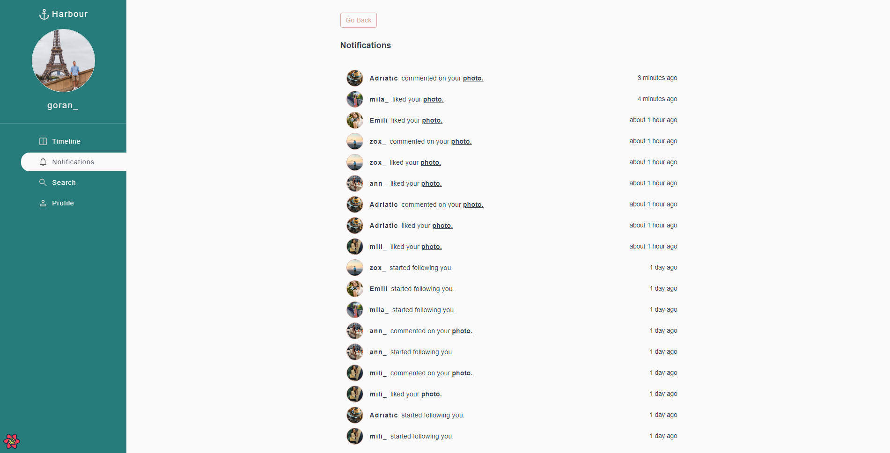

# Harbour

Harbour is a student project and a simple full-stack social media application created in the process of learning MERN stack technologies, ReactJS, NodeJS, ExpressJS, MongoDB and a further exploring libraries and technologies like React Router, Tanstack (React Query), Firebase/Storage for uploading files, Framer motion and more.

User can sign up and create a profile page, upload and delete photos, find friends, follow them, see their posts on timeline and profile page, like their photos and make comments. The user also receives notifications when another user starts following him, likes his photo or leaves a comment.

